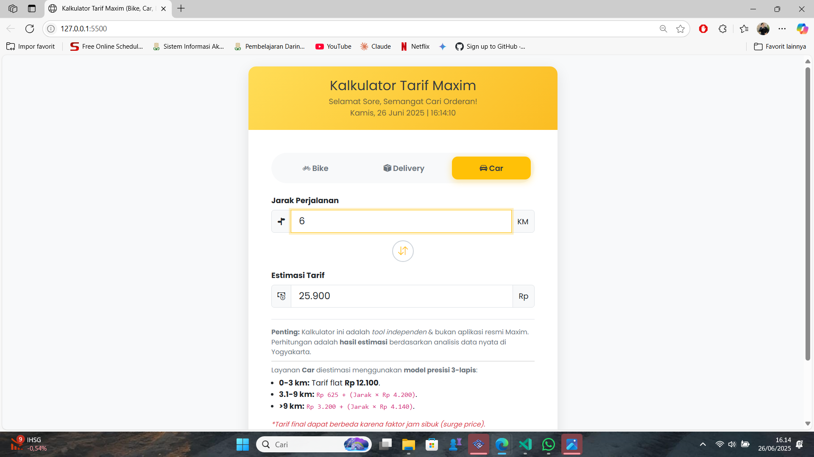

# Kalkulator Tarif Maxim (Bike, Bike Delivery, & Car) - Presisi Tinggi

  
  
  
  
  

Sebuah tool berbasis web presisi tinggi untuk membantu mitra driver Maxim menghitung dan memberikan estimasi **tarif dasar (normal)** untuk orderan offline. Proyek ini mendukung layanan **Bike**, **Bike Delivery**, dan **Car**, dibuat berdasarkan analisis data komprehensif dari puluhan orderan nyata di area Yogyakarta.

### Tampilan Aplikasi

  
  
  

---

## 🌐 Demo Langsung (Live Demo)

Aplikasi ini sudah di-hosting dan bisa diakses langsung melalui link di bawah ini.

**[➡️ Buka Kalkulator Tarif Maxim (Presisi Tinggi) ⬅️](https://hanipubaidur.github.io/KalkulatorMaxim/)**

---

## ✨ Fitur Utama

-   **Tiga Pilihan Layanan:** Pilih antara layanan **Bike**, **Bike Delivery**, dan **Car**.
-   **Model Perhitungan Presisi:** Mengimplementasikan model tarif unik yang sangat akurat untuk setiap layanan.
-   **Kalkulasi Dua Arah:** Hitung **Tarif dari Jarak** dan estimasi **Jarak dari Tarif**.
-   **Jam & Tanggal Dinamis:** Menampilkan waktu real-time yang terus bergerak.
-   **Desain Responsif & Tema Nyaman**.
-   **Transparansi Rumus:** Keterangan dinamis menampilkan formula tarif dasar yang digunakan.

---

## 💻 Teknologi yang Digunakan

-   **HTML5, CSS3 (Bootstrap 5), JavaScript (ES6)**

---

## ➗ Formula Perhitungan Tarif Dasar Akurat

Kalkulator ini menggunakan model perhitungan tarif dasar (normal) yang berbeda untuk setiap layanan.

### Layanan Maxim Bike
-   **Sistem:** 1 Lapis Progresif
-   **Formula:** `(Jarak × Rp 2.400) - Rp 1.800`
-   **Tarif Minimal:** `Rp 8.900`

### Layanan Maxim Bike Delivery
-   **Sistem:** 2 Lapis (Tiered System)
-   **Lapis 1 (0 - 3 km):** Tarif Flat `Rp 4.100`
-   **Lapis 2 (> 3 km):** `Rp 50 + (Jarak × Rp 1.650)`

### Layanan Maxim Car
-   **Sistem:** 3 Lapis (Tiered System)
-   **Lapis 1 (0 - 3 km):** Tarif Flat `Rp 12.100`
-   **Lapis 2 (3.1 - 9 km):** `Rp 625 + (Jarak × Rp 4.200)`
-   **Lapis 3 (> 9 km):** `Rp 3.200 + (Jarak × Rp 4.140)`

**Disclaimer:** Formula ini adalah hasil estimasi tarif dasar. Tarif final di aplikasi resmi Maxim dapat berbeda karena faktor dinamis seperti **jam sibuk (surge price)**, kondisi lalu lintas, dan kebijakan terbaru dari Maxim.

---

## 🤝 Kontribusi

Merasa ada perhitungan yang kurang akurat atau punya data orderan baru (terutama yang terkena surge price)? Anda bisa berkontribusi pada proyek ini!

1.  Buka tab **"Issues"** di halaman GitHub ini.
2.  Buat "New Issue" untuk melaporkan bug atau memberikan saran.
3.  Sertakan screenshot data orderan Anda agar formula bisa terus disempurnakan.

---

## 👤 Kredit

Dibuat dan dikembangkan berdasarkan ide dan data dari **Hanif Ubaidur Rohman Syah**.

-   **GitHub:** [hanipubaidur](https://github.com/hanipubaidur)

Proyek ini berada di bawah Lisensi MIT.